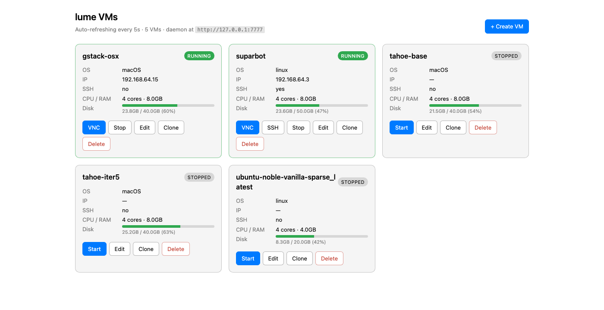

# lume-web-vm-manager

A tiny single-file dashboard for managing [lume](https://github.com/trycua/cua/tree/main/libs/lume) VMs from your browser. Standard library only — no `pip install`, no Docker, no JS framework. ~750 lines of Python.



## What it does

Reads the local `lume serve` daemon's HTTP API and renders a refreshing HTML page where you can:

- **Start / Stop** any VM
- **VNC** — opens macOS Screen Sharing via the `vnc://` URL scheme
- **SSH** — opens Terminal.app and runs `lume ssh <name>` (auto-handles default `lume:lume` creds)
- **Edit settings** — CPU, RAM, disk size (grow only), display resolution
- **Clone** — full copy with a new name
- **Delete** — with browser confirm prompt
- **Create** — three modes:
  - Empty Linux disk (instant)
  - Pull a pre-built image from `ghcr.io/trycua` (curated dropdown of known-working tags)
  - macOS from IPSW with optional unattended Setup Assistant preset

Auto-refreshes every 5s, but pauses while you have a dialog open or are typing in a form so it doesn't wipe your input.

## Heads-up: lume v0.3.9 caveats

This dashboard exposes the full lume feature set, but two things in lume itself are currently broken upstream — surfaced here so you understand why some create paths won't work:

| Broken | Why | Status |
|---|---|---|
| `lume pull macos-*` | lume v0.3.9 can't read the new OCI tar-part layer format the trycua team published their macOS images in | [PR #1395](https://github.com/trycua/cua/pull/1395) — open, unmerged |
| `lume create --unattended tahoe` | The 167-step click-automation script looks for a Setup Assistant button (`Set Up Later`) Apple renamed in macOS 26.4.x | No public tracking issue |

**Linux pulls work fine.** macOS is reachable today via the dashboard's *macOS (IPSW)* tab → Setup Assistant: **Manual** → click through Setup Assistant via VNC after the installer finishes (~5–10 min). The dashboard surfaces these caveats inline in the create dialog so you don't blunder into a known-broken combination.

## Requirements

- Apple Silicon Mac (lume is Apple Silicon only)
- macOS 13+ (15+ if you want host↔guest clipboard sharing in the resulting VMs)
- Python 3.9+ (already on macOS — `python3` works)
- [lume](https://github.com/trycua/cua/tree/main/libs/lume) installed and `lume serve` running on `127.0.0.1:7777`. The lume installer wires up a LaunchAgent for `lume serve` automatically.

No Python dependencies. Stdlib only.

## Install + run

```bash
git clone https://github.com/orzelig/lume-web-vm-manager.git
cd lume-web-vm-manager
python3 server.py --port 8080
```

Then open <http://127.0.0.1:8080/>.

The `lume` binary is auto-discovered from (in order):
1. `$LUME_BIN` env var
2. `$PATH`
3. Common install locations: `~/.local/bin/lume`, `/usr/local/bin/lume`, `/opt/homebrew/bin/lume`

Override the daemon URL with `LUME_DAEMON_URL=http://...` if you've moved `lume serve` off the default `127.0.0.1:7777`.

## Auto-start at login

A LaunchAgent template ships in [`launchd/local.lume-web.plist`](launchd/local.lume-web.plist). Install it with:

```bash
# From the repo root, after cloning
sed "s|__SERVER_PY__|$PWD/server.py|g; s|__USER_HOME__|$HOME|g" \
    launchd/local.lume-web.plist \
    > ~/Library/LaunchAgents/local.lume-web.plist
launchctl load ~/Library/LaunchAgents/local.lume-web.plist
```

Logs go to `/tmp/lume-web.log`. KeepAlive is on, so it restarts if it crashes.

To remove:
```bash
launchctl unload ~/Library/LaunchAgents/local.lume-web.plist
rm ~/Library/LaunchAgents/local.lume-web.plist
```

## Security

The server binds **`127.0.0.1` only** — it is not reachable from your LAN, the internet, Tailscale peers, or any remote host. Verify yourself:

```bash
$ lsof -nP -iTCP:8080 -sTCP:LISTEN
COMMAND  PID  USER  FD  TYPE  ...  NAME
Python   ...  ...   ..  IPv4  ...  TCP 127.0.0.1:8080 (LISTEN)
                                       ^^^^^^^^^ loopback only

$ LAN_IP=$(ipconfig getifaddr en0)
$ curl -s --max-time 2 -o /dev/null -w '%{http_code}\n' "http://$LAN_IP:8080/"
000   # connection refused at the kernel
```

Caveat: loopback is per-machine, not per-user. On a multi-user Mac, any logged-in user can reach `http://127.0.0.1:8080`. For a personal laptop this is irrelevant.

The dashboard executes shell commands locally (e.g. `lume delete`, `osascript` to open Terminal). All VM-name and image-tag inputs are validated against tight regexes (`[A-Za-z0-9._-]+` and `name:tag`) and passed through `subprocess.run` as a list (no shell), so the input fields can't be used to inject arbitrary commands.

## How it works

Single file, three layers:

- **Read path:** `GET /lume/vms` from the daemon → render Python f-strings → HTML response. Re-fetched every 5s by client-side JS that pauses while a `<dialog>` is open.
- **Mutation path:** form `POST /<action>/<name>` → `subprocess.run([LUME_BIN, ...args])` → 303 redirect with a `?f=ok&m=...` flash. CLI is the canonical interface; using it avoids reverse-engineering the daemon's undocumented JSON request schemas.
- **Long ops (create, pull, ssh):** spawn Terminal.app via `osascript` so you can watch IPSW downloads / image pulls / SSH sessions interactively. The shell command is built with `shlex.quote()` and embedded into AppleScript using `json.dumps()` (whose escape rules match AppleScript string literals — convenient).

Auto-refresh skips when:
1. Any `<dialog>` element is `[open]`, OR
2. `document.activeElement` is an `input`, `textarea`, or `select`.

## Limitations

- **No native rename** — lume doesn't support it. Workaround: Clone with the new name, then Delete the original. (Doubles disk briefly during clone.)
- **No multi-host support** — only talks to `127.0.0.1:7777`.
- **No auth** — relies on loopback-only binding. Don't reverse-proxy this to the public internet.
- **macOS-only host** — uses `osascript` and `Terminal.app` for SSH/long-op spawning. Linux/Windows hosts would need different spawning code.

## License

[MIT](LICENSE) © 2026 orzelig
